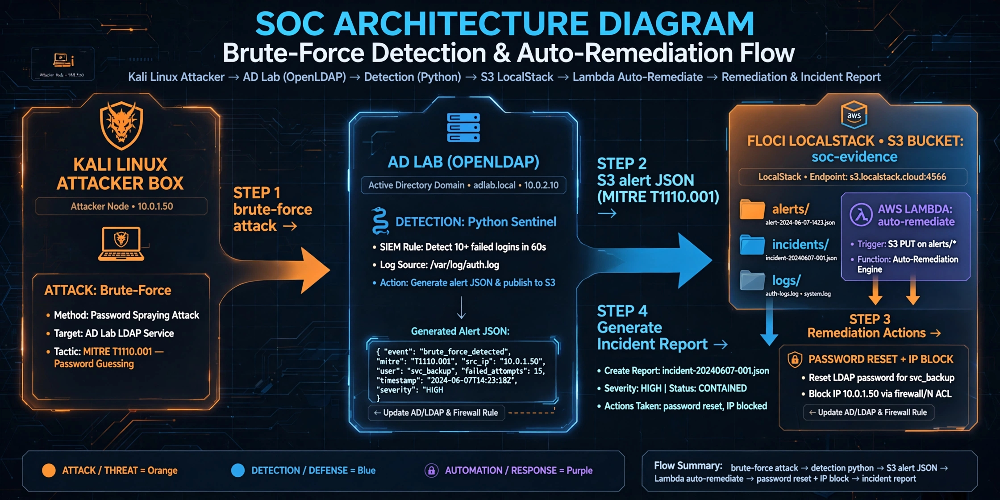

# ACTIVE DIRECTORY PENTESTING - COMPLETE BEGINNER'S GUIDE

> Master AD Pentesting from Zero to Hero. Real labs, real attacks, real defense.

## What You Will Learn
- AD Architecture & Kerberos
- Enumeration & Recon
- Misconfigurations Exploitation
- Lateral Movement & Privilege Escalation
- Labs + Defense Hardening
- Interview Prep

## Lab SOC - Detection & Response
Kali brute-force -> AD lab.local -> Detection Python (MITRE T1110.001) -> S3 soc-evidence -> Lambda auto-remediate

### Evidences S3
- alerts/brute-force-*.json Level 10
- incidents/INC-*.json REMEDIATED
- logs/auth.log
