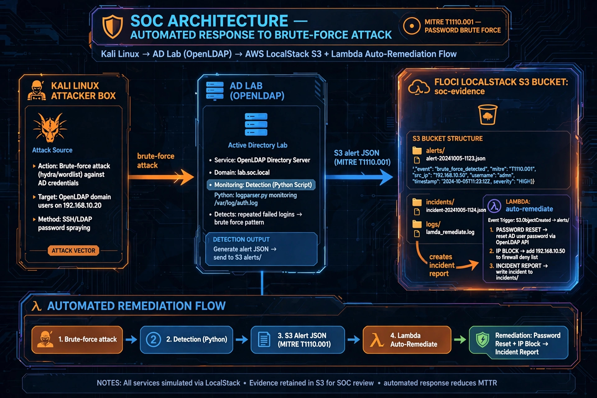

# SOC Lab - floci + AD + Kali + S3



## Fluxo Completo - Lab 2 e 3 Finalizados
Kali brute-force -> AD lab.local -> Detection Python (MITRE T1110.001) -> S3 soc-evidence -> Lambda auto-remediate -> Incident Report

## Evidencias S3
- alerts/brute-force-*.json Level 10
- incidents/INC-*.json REMEDIATED
- logs/auth.log

## Validacao
```bash
docker compose -f docker-compose.lab.yml up -d
python3 detect-brute-force.py
python3 lambda-remediate/lambda_function.py
aws --endpoint-url=http://localhost:4566 s3 ls s3://soc-evidence/ --recursive
